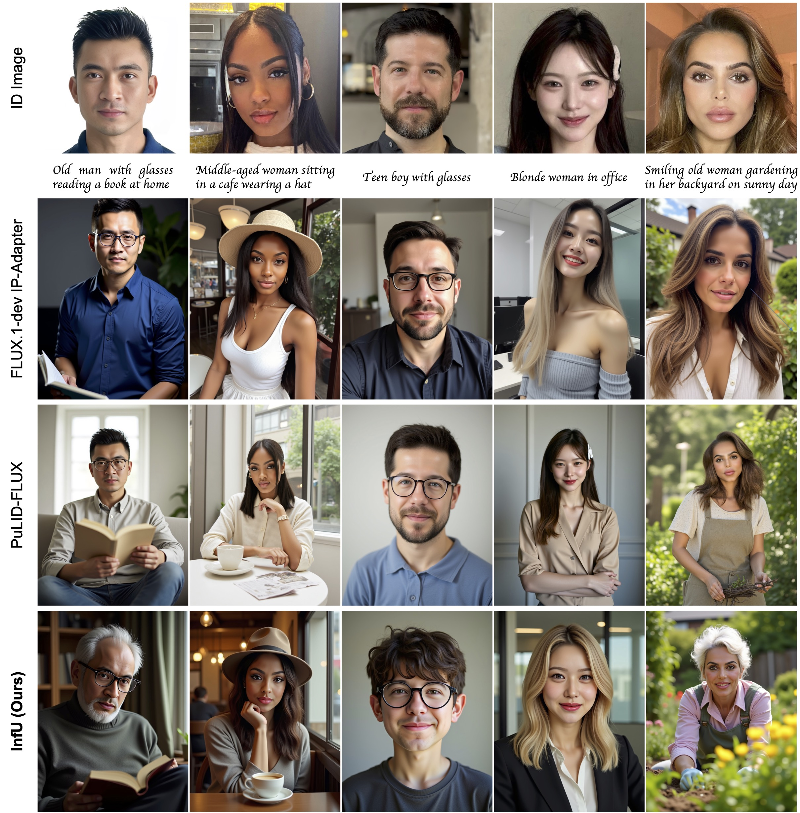
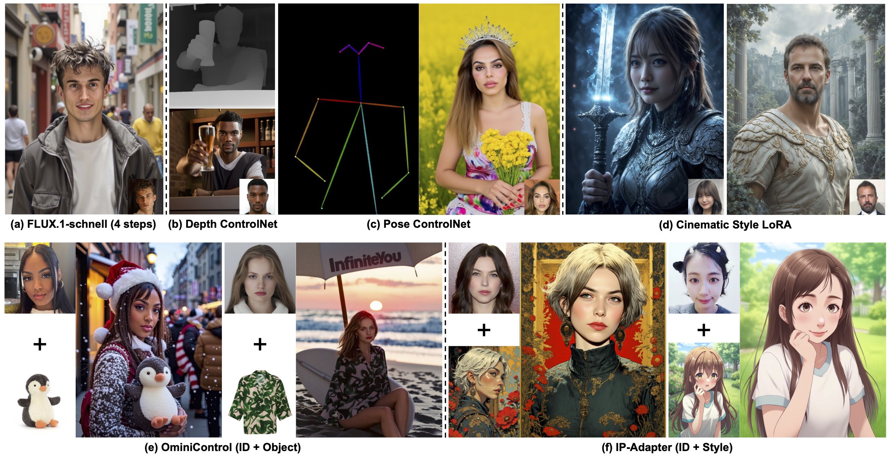

<div align="center">

## InfiniteYou: Flexible Photo Recrafting While Preserving Your Identity

[**Liming Jiang**](https://liming-jiang.com/)&nbsp;&nbsp;&nbsp;&nbsp;
[**Qing Yan**](https://scholar.google.com/citations?user=0TIYjPAAAAAJ)&nbsp;&nbsp;&nbsp;&nbsp;
[**Yumin Jia**](https://www.linkedin.com/in/yuminjia/)&nbsp;&nbsp;&nbsp;&nbsp;
[**Zichuan Liu**](https://scholar.google.com/citations?user=-H18WY8AAAAJ)&nbsp;&nbsp;&nbsp;&nbsp;
[**Hao Kang**](https://scholar.google.com/citations?user=VeTCSyEAAAAJ)&nbsp;&nbsp;&nbsp;&nbsp;
[**Xin Lu**](https://scholar.google.com/citations?user=mFC0wp8AAAAJ)<br />
ByteDance Intelligent Creation

<a href="https://bytedance.github.io/InfiniteYou"></a> &ensp;
<a href="https://arxiv.org/abs/2503.16418"></a> &ensp;
<a href="https://arxiv.org/pdf/2503.16418"></a> &ensp;
<a href="https://huggingface.co/spaces/ByteDance/InfiniteYou-FLUX"></a> &ensp;

</div>


> **Abstract:** *Achieving flexible and high-fidelity identity-preserved image generation remains formidable, particularly with advanced Diffusion Transformers (DiTs) like FLUX. We introduce **InfiniteYou (InfU)**, one of the earliest robust frameworks leveraging DiTs for this task. InfU addresses significant issues of existing methods, such as insufficient identity similarity, poor text-image alignment, and low generation quality and aesthetics. Central to InfU is InfuseNet, a component that injects identity features into the DiT base model via residual connections, enhancing identity similarity while maintaining generation capabilities. A multi-stage training strategy, including pretraining and supervised fine-tuning (SFT) with synthetic single-person-multiple-sample (SPMS) data, further improves text-image alignment, ameliorates image quality, and alleviates face copy-pasting. Extensive experiments demonstrate that InfU achieves state-of-the-art performance, surpassing existing baselines. In addition, the plug-and-play design of InfU ensures compatibility with various existing methods, offering a valuable contribution to the broader community.*


## 🔥 News

- [03/2025] 🔥 The [code](https://github.com/bytedance/InfiniteYou), [model](https://huggingface.co/ByteDance/InfiniteYou), and [demo](https://huggingface.co/spaces/ByteDance/InfiniteYou-FLUX) of InfiniteYou-FLUX v1.0 are released.

- [03/2025] 🔥 The [project page](https://bytedance.github.io/InfiniteYou) of InfiniteYou is created.

- [03/2025] 🔥 The [paper](https://arxiv.org/abs/2503.16418) of InfiniteYou is released on arXiv.


## 💡 Important Usage Tips

- We released two model variants of InfiniteYou-FLUX v1.0: [aes_stage2](https://huggingface.co/ByteDance/InfiniteYou/tree/main/infu_flux_v1.0/aes_stage2) and [sim_stage1](https://huggingface.co/ByteDance/InfiniteYou/tree/main/infu_flux_v1.0/sim_stage1). The `aes_stage2` is our model after SFT, which is used by default for better text-image alignment and aesthetics. For higher ID similarity, please try `sim_stage1` (using `--model_version` to switch). More details can be found in our [paper](https://arxiv.org/abs/2503.16418).

- To better fit specific personal needs, we find that two arguments are highly useful to adjust: <br />`--infusenet_conditioning_scale` (default: `1.0`) and `--infusenet_guidance_start` (default: `0.0`). Usually, you may NOT need to adjust them. If necessary, start by trying a slightly larger <br />`--infusenet_guidance_start` (*e.g.*, `0.1`) only (especially helpful for `sim_stage1`). If still not satisfactory, then try a slightly smaller `--infusenet_conditioning_scale` (*e.g.*, `0.9`).

- We also provided two LoRAs ([Realism](https://civitai.com/models/631986?modelVersionId=706528) and [Anti-blur](https://civitai.com/models/675581/anti-blur-flux-lora)) to enable additional usage flexibility. They are *entirely optional*, which are examples to facilitate users to try but are NOT used in our paper.

- If the generated gender does not align with your preferences, try adding specific words in the text prompt, such as 'a man', 'a woman', *etc*. We encourage users to use inclusive and respectful language.


## :european_castle: Model Zoo

| InfiniteYou Version | Model Version | Base Model Trained with | Description |  
| :---: | :---: | :---: | :---: |
| [InfiniteYou-FLUX v1.0](https://huggingface.co/ByteDance/InfiniteYou) | [aes_stage2](https://huggingface.co/ByteDance/InfiniteYou/tree/main/infu_flux_v1.0/aes_stage2) | [FLUX.1-dev](https://huggingface.co/black-forest-labs/FLUX.1-dev) | Stage-2 model after SFT. Better text-image alignment and aesthetics. |
| [InfiniteYou-FLUX v1.0](https://huggingface.co/ByteDance/InfiniteYou) | [sim_stage1](https://huggingface.co/ByteDance/InfiniteYou/tree/main/infu_flux_v1.0/sim_stage1) | [FLUX.1-dev](https://huggingface.co/black-forest-labs/FLUX.1-dev) | Stage-1 model before SFT. Higher identity similarity. |


## 🔧 Requirements and Installation

Simply run this one-line command to install (feel free to create a `python3` virtual environment before you run):

```bash
pip install -r requirements.txt
```


## ⚡️ Quick Inference

### Local Inference Script

```bash
python test.py --id_image ./assets/examples/yann-lecun_resize.jpg --prompt "A man, portrait, cinematic" --out_results_dir ./results
```

<details>
<summary style='font-size:20px'><b><i>Explanation of all the arguments (click to expand!)</i></b></summary>

- Input and output:
  - `--id_image (str)`: The path to the input identity (ID) image. Default: `./assets/examples/yann-lecun_resize.jpg`.
  - `--prompt (str)`: The text prompt for image generation. Default: `A man, portrait, cinematic`.
  - `--out_results_dir (str)`: The path to the output directory to save the generated results. Default: `./results`.
  - `--control_image (str or None)`: The path to the control image \[*optional*\] to extract five facical keypoints to control the generation. Default: `None`.
  - `--base_model_path (str)`: The huggingface or local path to the base model. Default: `black-forest-labs/FLUX.1-dev`.
  - `--model_dir (str)`: The path to the InfiniteYou model directory. Default: `ByteDance/InfiniteYou`.
- Version control:
  - `--infu_flux_version (str)`: InfiniteYou-FLUX version: currently only `v1.0` is supported. Default: `v1.0`.
  - `--model_version (str)`: The model variant to use: `aes_stage2` | `sim_stage1`. Default: `aes_stage2`.
- General inference arguments:
  - `--cuda_device (int)`: The cuda device ID to use. Default: `0`.
  - `--seed (int)`: The seed for reproducibility (0 for random). Default: `0`.
  - `--guideance_scale (float)`: The guidance scale for the diffusion process. Default: `3.5`.
  - `--num_steps (int)`: The number of inference steps. Default: `30`.
- InfiniteYou-specific arguments:
  - `--infusenet_conditioning_scale (float)`: The scale for the InfuseNet conditioning. Default: `1.0`.
  - `--infusenet_guidance_start (float)`: The start point for the InfuseNet guidance injection. Default: `0.0`.
  - `--infusenet_guidance_end (float)`: The end point for the InfuseNet guidance injection. Default: `1.0`.
- Optional LoRAs:
  - `--enable_realism_lora (store_true)`: Whether to enable the Realism LoRA. Default: `False`.
  - `--enable_anti_blur_lora (store_true)`: Whether to enable the Anti-blur LoRA. Default: `False`.

</details>


### Local Gradio Demo

```bash
python app.py
```

### Online Hugging Face Demo

We appreciate the GPU grant from the Hugging Face team. 
You can also try our [InfiniteYou-FLUX Hugging Face demo](https://huggingface.co/spaces/ByteDance/InfiniteYou-FLUX) online.


## 🆚 Comparison with State-of-the-Art Relevant Methods



Qualitative comparison results of InfU with the state-of-the-art baselines, FLUX.1-dev IP-Adapter and PuLID-FLUX. The identity similarity and text-image alignment of the results generated by FLUX.1-dev IP-Adapter (IPA) are inadequate. PuLID-FLUX generates images with decent identity similarity. However, it suffers from poor text-image alignment (Columns 1, 2, 4), and the image quality (e.g., bad hands in Column 5) and aesthetic appeal are degraded. In addition, the face copy-paste issue of PuLID-FLUX is evident (Column 5). In comparison, the proposed InfU outperforms the baselines across all dimensions.


## ⚙️ Plug-and-Play Property with Off-the-Shelf Popular Approaches



InfU features a desirable plug-and-play design, compatible with many existing methods. It naturally supports base model replacement with any variants of FLUX.1-dev, such as FLUX.1-schnell for more efficient generation (e.g., in 4 steps). The compatibility with ControlNets and LoRAs provides more controllability and flexibility for customized tasks. Notably, the compatibility with OminiControl extends our potential for multi-concept personalization, such as interacted identity (ID) and object personalized generation. InfU is also compatible with IP-Adapter (IPA) for stylization of personalized images, producing decent results when injecting style references via IPA. Our plug-and-play feature may extend to even more approaches, providing valuable contributions to the broader community.


## 📜 Disclaimer and Licenses

Most images used in this repository and related demos are sourced from consented subjects, with a few taken from public domains or generated by models. These pictures are intended solely to showcase the capabilities of our research. If you have any concerns, please contact us, and we will promptly remove any inappropriate content.

The use of the released code, model, and demo must strictly adhere to the respective licenses. Our code is released under the [Apache 2.0 License](./LICENSE), and our model is released under the [Creative Commons Attribution-NonCommercial 4.0 International Public License](https://huggingface.co/ByteDance/InfiniteYou/blob/main/LICENSE) for academic research purposes only. Any manual or automatic downloading of the face models from [InsightFace](https://github.com/deepinsight/insightface), the [FLUX.1-dev](https://huggingface.co/black-forest-labs/FLUX.1-dev) base model, LoRAs ([Realism](https://civitai.com/models/631986?modelVersionId=706528) and [Anti-blur](https://civitai.com/models/675581/anti-blur-flux-lora)), *etc.*, must follow their original licenses and be used only for academic research purposes.

This research aims to positively impact the field of Generative AI. Users are granted the freedom to create images using this tool, but they must comply with local laws and use it responsibly. The developers do not assume any responsibility for potential misuse by users.


## 🤗 Acknowledgments

We sincerely acknowledge the insightful discussions from Stathi Fotiadis, Min Jin Chong, Xiao Yang, Tiancheng Zhi, Jing Liu, and Xiaohui Shen. We genuinely appreciate the help from Jincheng Liang and Lu Guo with our user study and qualitative evaluation.


## 📖 Citation

If you find InfiniteYou useful for your research or applications, please cite our paper:

```bibtex
@article{jiang2025infiniteyou,
  title={{InfiniteYou}: Flexible Photo Recrafting While Preserving Your Identity},
  author={Jiang, Liming and Yan, Qing and Jia, Yumin and Liu, Zichuan and Kang, Hao and Lu, Xin},
  journal={arXiv preprint},
  volume={arXiv:2503.16418},
  year={2025}
}
```

We also appreciate it if you could give a star :star: to this repository. Thanks a lot!
